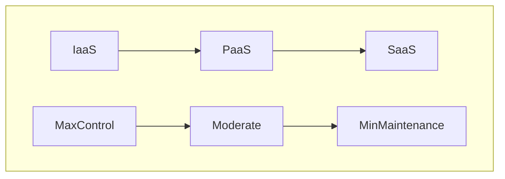

# Fundamental Cloud Concepts for AWS

## Cons of Traditional Data Centers
1. Large up-front investments
2. Forecasting demand is difficult
3. Slow to deploy new data centers and servers (slow response to changes in demand)
4. Maintaining data centers is expensive
5. You own all the security and compliance burden

## Benefits of Cloud Computing
1. Trade capital expenses for variable expenses, i.e.- there is no large initial investment instead you pay for time as it is used.
2. Benefit from massive economies of scale, AWS buys on a large scale and passes the cost benefits on to the customer. 
3. Stop guessing capacity
4. Increase speed and agility (access to emerging tech, trying out new ideas at a minimum cost, reduced maintenance times)
5. Stop spending money maintaining data centers
6. go global within minutes

A well-architected AWS framework provides **elasticity, reliability, and agility.**

"elasticity is the ability to acquire resources as you need them and release resources when you no longer need them. In the cloud, you want to do this automatically."

## Cloud Computing
Cloud computing is: "The on-demand delivery of compute power, database storage, applications, and other IT resources through a cloud services platform via the Internet with pay-as-you-go pricing"

Key:
Infrastructure as a Service (IaaS) 
Platform as a Service (PaaS)
Software as a Service (SaaS)

### Cloud Deployment Models:
**Public Cloud:** AKA-The Cloud. Deployed onto a public cloud provider like AWS, Microsoft Azure, or the Google Cloud Platform.

**On Premises Cloud:** AKA- Private Cloud. Deployed in a private data center using a cloud-like platform provided by vendors like VMWare.

**Hybrid**: deployed with a mix of the previous two options using both provided like AWS alongside a cloud-like platform in a private data center.

## AWS Global Infrastructure
There are four primary elements of AWS Global Infracture:
1. Region
2. Availablity Zones
3. Local Zones
4. Edge Locations

### AWS Regions
An AWS Region represents a **cluster of data centers** in a specific geograpic location.
There are currently (15/05/2023) 34 regions.

#### Availablity Zones:
One or more data center within a region. There are multiple availablity zones within each region.
The purpose of an availability zones is to make sure there is never a scenario where an entire region would be down, as they have redundant power, networking, and connectivity. 
There are currently (15/05/2023) 103 availability zones.

#### Local Zone & Wavelength Zone
AWS Local Zones place compute, storage, database, and other select AWS services closer to end-users. Each AWS local Zone location is an extension of an AWS Region. AWS Local Zones provide a high-bandwidth, secure connection between local workloads and those runing in the AWS Region, allowing you to seamlessly connect to the full range of in-region services through the same APIs and toolsets.

Wavelength zones are AWS infrastructures deployments that embed AWS compute and storage services with communication service providers' (CSP) 5G networks, so appliciaton traffic from 5G devices reach application servers running in Wavelength Zones without leaving the telecommunications network.

#### Edge Locations
_Points of Presences:_ elements of the AWS global infrastructure that exist outside of the AWS regions. These elements are located in or near populated areas, and specific AWS services use them to deliver content to end users as quickly as possible. Within the overall points of presence, there are two types of infrastructure: edge locations and regional edge caches.
There are currently (15/05/2023) over 400 edge locations.

Edge locations are used as nodes of a global content delivery network. There are specific services that utilize these locations including Amazon CloudFront and Amazon Route 53. 
The primary purpose of edge locations is that is allows AWS to service content from locations closest to users.

### Visualising AWS Global Infrastructure

