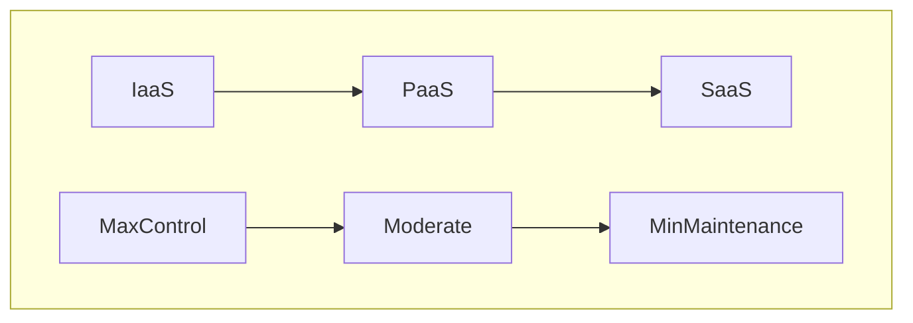

# Fundamental Cloud Concepts for AWS

## Cons of Traditional Data Centers
1. Large up-front investments
2. Forecasting demand is difficult
3. Slow to deploy new data centers and servers (slow response to changes in demand)
4. Maintaining data centers is expensive
5. You own all the security and compliance burden

## Benefits of Cloud Computing
1. Trade capital expenses for variable expenses, i.e.- there is no large initial investment instead you pay for time as it is used.
2. Benefit from massive economies of scale, AWS buys on a large scale and passes the cost benefits on to the customer. 
3. Stop guessing capacity
4. Increase speed and agility (access to emerging tech, trying out new ideas at a minimum cost, reduced maintenance times)
5. Stop spending money maintaining data centers
6. go global within minutes

A well-architected AWS framework provides **elasticity, reliability, and agility.**

"elasticity is the ability to acquire resources as you need them and release resources when you no longer need them. In the cloud, you want to do this automatically."

## Cloud Computing
Cloud computing is: "The on-demand delivery of compute power, database storage, applications, and other IT resources through a cloud services platform via the Internet with pay-as-you-go pricing"

Key:
Infrastructure as a Service (IaaS) 
Platform as a Service (PaaS)
Software as a Service (SaaS)

### Cloud Deployment Models:
**Public Cloud:** AKA-The Cloud. Deployed onto a public cloud provider like AWS, Microsoft Azure, or the Google Cloud Platform.

**On Premises Cloud:** AKA- Private Cloud. Deployed in a private data center using a cloud-like platform provided by vendors like VMWare.

**Hybrid**: deployed with a mix of the previous two options using both provided like AWS alongside a cloud-like platform in a private data center.
